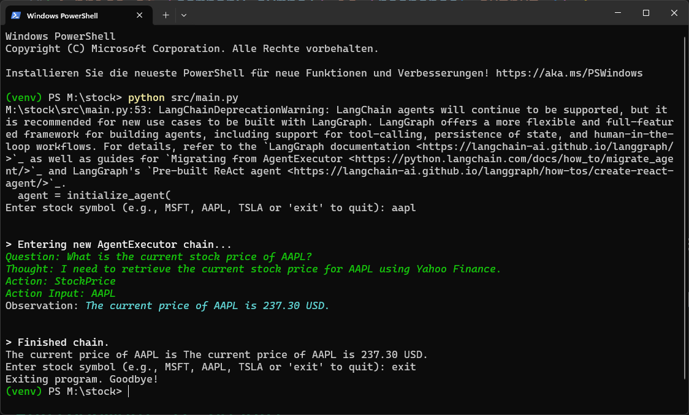

# TamerOnline-Stock 📈

## Overview
TamerOnline-Stock is a **stock price retrieval tool** powered by **Yahoo Finance (yfinance)** and **LangChain**, utilizing the **Ollama3.2** model for intelligent querying. It provides **real-time stock prices** and allows easy interaction via a virtual assistant.

## 🖼 Screenshots


## Features 🚀
- **Real-time Stock Prices**: Fetch live stock prices using Yahoo Finance.
- **AI-Powered Assistant**: Leverages **LangChain** and **Ollama3.2** for smart stock analysis.
- **Multi-Platform Support**: Works on **Windows, Linux, and macOS**.
- **Automated Virtual Environment Setup**: Supports Python virtual environments (`venv`).
- **GitHub CI/CD Integration**: Automated testing and dependency management.
- **Secure & Efficient**: Implements error handling and retries for stability.

## Prerequisites 🛠️
- **Python 3.10+** installed.
- **Git** installed (for cloning the repository).
- **Pip** installed and up-to-date.

## Installation 📦
Clone the repository:
```bash
git clone https://github.com/TamerOnLine/tameronline-stock.git
cd tameronline-stock
```

### Setting up the Virtual Environment
#### Windows:
```cmd
activate_project.bat
```
#### PowerShell:
```powershell
.\activate_project.ps1
```
#### Linux/macOS:
```bash
chmod +x activate_project.sh
./activate_project.sh
```

Install dependencies:
```bash
pip install -r requirements.txt
```

## Usage 🏗️
### Running the Stock Price Query
Start the agent:
```bash
python src/main.py
```
Then enter a stock symbol:
```
Enter stock symbol (e.g., MSFT, AAPL, TSLA or 'exit' to quit): AAPL
```
Output:
```
The current price of AAPL is 145.67 USD.
```

### Running Ollama AI Assistant
Run:
```bash
python src/run_ollama.py
```
You can now enter any query, such as:
```
Ihre Frage: What is the future of AI?
```

## Project Structure 📂
```
tameronline-stock/
├── .github/workflows/   # GitHub Actions for CI/CD
├── img/                 # Image assets (if needed)
├── src/                 # Source code
│   ├── main.py          # Main stock price retrieval script
│   ├── run_ollama.py    # AI assistant integration
│   ├── runner.py        # Helper script to manage execution
├── tests/               # Unit tests
├── activate_project.bat # Windows activation script
├── activate_project.ps1 # PowerShell activation script
├── activate_project.sh  # Linux/macOS activation script
├── requirements.txt     # Dependencies list
├── LICENSE              # License file
├── README.md            # Documentation
└── runtime.txt          # Python version info
```

## Running Tests 🧪
To run tests, use:
```bash
pytest --disable-warnings -v
```

## Troubleshooting 🔧
- **Python not found**: Ensure Python 3.10+ is installed and added to your system PATH.
- **Stock price not available**: The stock ticker might be incorrect or unavailable on Yahoo Finance.
- **Permission issues on Linux/macOS**: Run `chmod +x activate_project.sh` to allow execution.

## Contributing 🤝
Feel free to submit pull requests or report issues in the [GitHub repository](https://github.com/TamerOnLine/tameronline-stock).

## License 📜
This project is licensed under the MIT License. See [LICENSE](LICENSE) for details.

---

🚀 **Start tracking stock prices today!**
